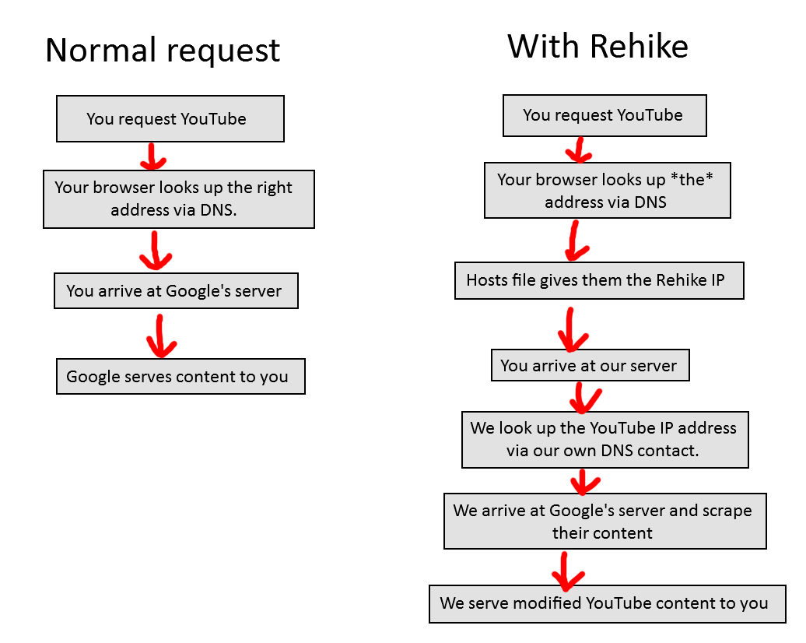

# How Rehike works

Rehike is a custom server application that aims to replicate content produced by the legacy YouTube frontend server. To put it more simply, we generate our own HTML documents (based off of archived YouTube documents) with data from YouTube's private InnerTube API spliced in.

Rehike acts as a man in the middle between you and YouTube, intercepting requests to YouTube and redirecting them through our own server.

To simplify, I spent five seconds in paint.net to draw up a quick lil flowchart:

## Why not just write a browser extension?

We hate JavaScript &lt;3

No, seriously, that was one of the biggest considerations that played into us making a server application like this. No matter how good a browser extension could get, it would always have an uncanny valley feel while the page is loading, because clearing the document would obviously trigger DOMContentLoaded.

Apart from that, it would mean we would need to hook network APIs (mostly XHR) and the codebase overall would be way more complicated in order to replicate the experience.

It just isn't something we want to do. There are [Cosmic Cat](//github.com/cosmic-cat-yt/Cosmic-Cat) and V3 to fill this purpose.